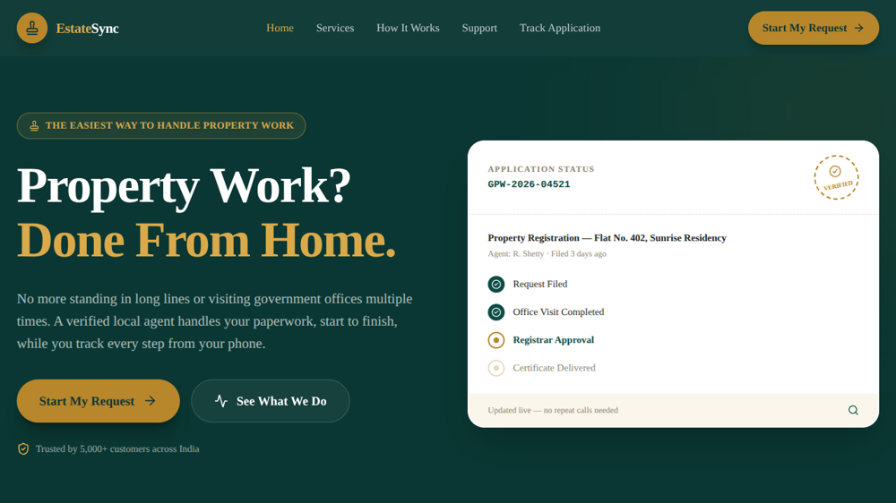
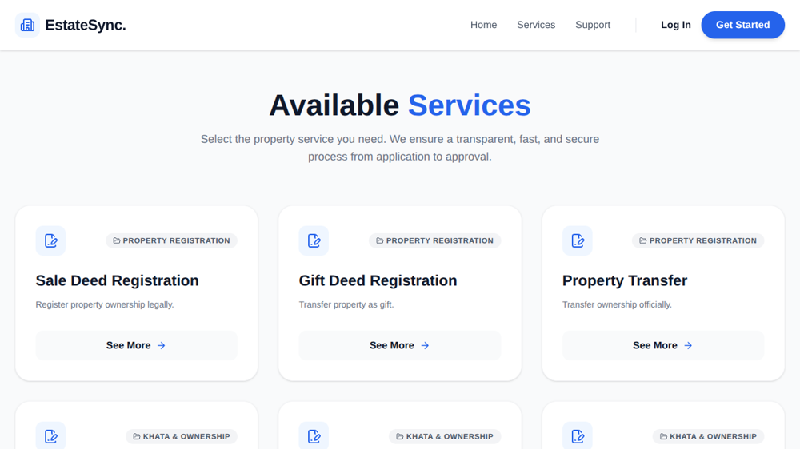
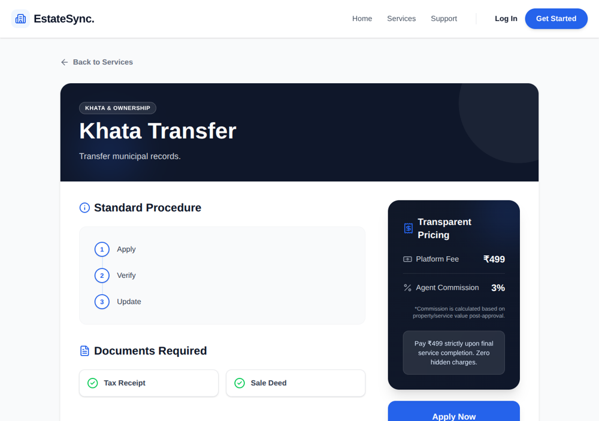
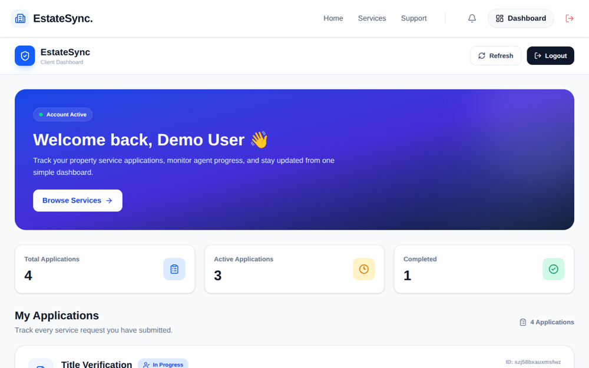
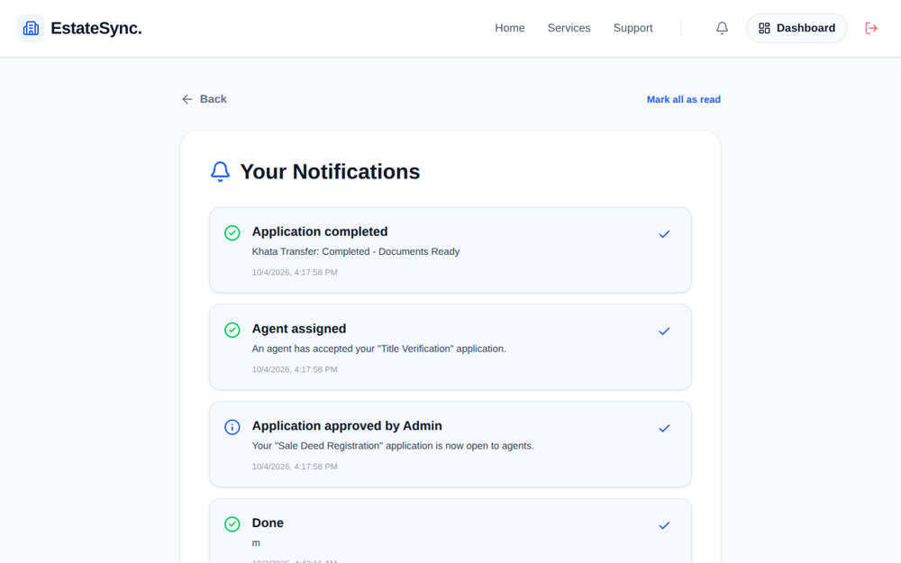
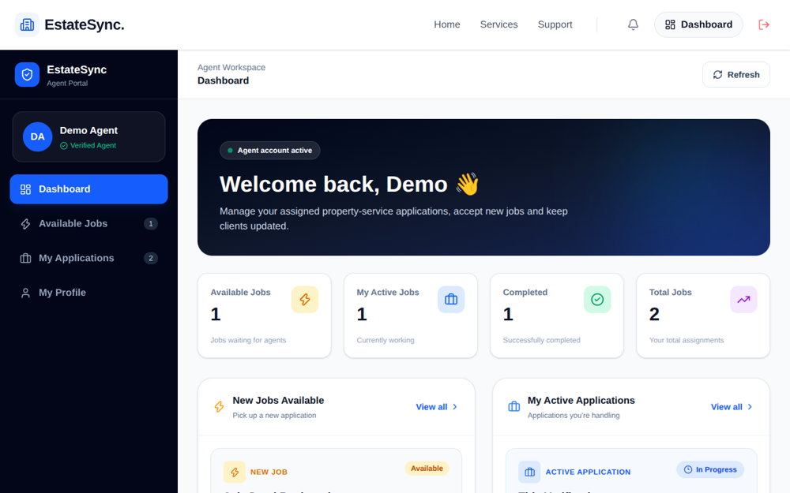
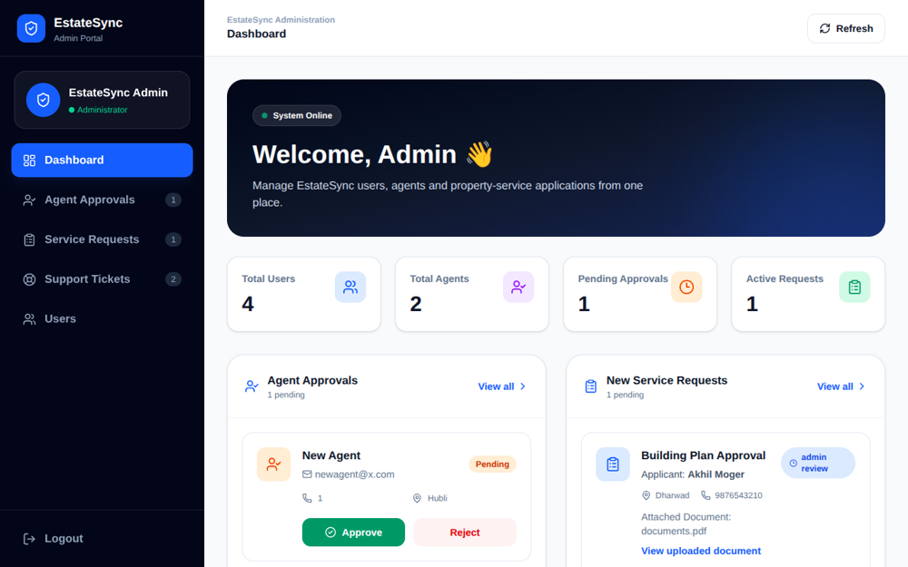

# EstateSync

**Property paperwork made easy.** Users apply online, the Admin checks the request, and an approved Agent does the work. Everyone can see the live progress.

> A BCA college project - Shree Guru Sudhindra College of Computer Applications, Bhatkal (Karnatak University).



---

## Why EstateSync?

Property work (Sale Deed, Khata transfer, plan approval, legal checks) needs many visits to government offices and often depends on middlemen. EstateSync lets a person apply from home, shows a clear fee, and tracks every step.

**Fees shown to the user:** Rs. 499 platform fee + 3% agent commission.

## Features

| Role | What they can do |
|------|------------------|
| **User** | Register, browse 20 services, apply with a document (max 5 MB), track status, read notifications |
| **Agent** | Register (needs Admin approval), see open jobs, accept a job, update progress, mark completed |
| **Admin** | Approve agents, review requests, send requests to the Agent Pool, read support tickets, see all users |

- 20 property services in 8 categories
- Role-based dashboards and protected pages
- Real file upload
- Notifications at every step
- Help and Support form
- Safe database rules (each role sees only its own data)

## How it works

```
User applies -> Admin reviews -> Agent accepts -> Progress updates -> Completed
                         (user gets a notification at each step)
```

| Status | Meaning |
|--------|---------|
| `admin_review` | Waiting for the Admin |
| `pending_agent` | Open to approved agents |
| `in_progress` | An agent is working on it |
| `completed` | Work finished |

## Screenshots

| | |
|---|---|
|  |  |
|  |  |
|  |  |

## Tech stack

- **Front end:** React, Vite, Tailwind CSS, React Router, Lucide icons
- **Back end:** PocketBase (database, login, file storage, real-time)
- **Tools:** Node.js, Git, GitHub, VS Code

## Run on your computer

**You need:** [Node.js 18+](https://nodejs.org) and [PocketBase](https://pocketbase.io/docs).

**1. Get the code and install**
```
git clone https://github.com/akhil-moger05/estate-sync.git
cd estate-sync
npm install
```

**2. Add PocketBase**
Download PocketBase for your system and put `pocketbase.exe` (or `pocketbase`) inside the `pocketbase` folder.

**3. Start PocketBase (keep this window open)**
```
cd pocketbase
.\pocketbase.exe superuser upsert you@example.com YourStrongPass123
.\pocketbase.exe serve
```
(Mac/Linux: `./pocketbase` instead of `.\pocketbase.exe`)

**4. Create the tables and demo accounts (first time only)**
Open a second terminal in the project folder.

Windows PowerShell:
```
$env:PB_ADMIN_EMAIL="you@example.com"
$env:PB_ADMIN_PASSWORD="YourStrongPass123"
npm run setup-db
```
Mac/Linux:
```
PB_ADMIN_EMAIL=you@example.com PB_ADMIN_PASSWORD=YourStrongPass123 npm run setup-db
```

**5. Start the website**
```
npm run dev
```
Open http://localhost:5173

## Demo accounts

| Role | Email | Password |
|------|-------|----------|
| Admin | admin@estatesync.com | Admin@12345 |
| Agent | agent@estatesync.com | Agent@12345 |
| User | user@estatesync.com | User@12345 |

These are for demo only. Change them before any real use.
The OTP step in Register is a demo (test code `1234`).

## Try the full flow (5 minutes)

1. Login as **User**, open a service, and apply with a file.
2. Login as **Admin**, press **Send to Agent Pool**.
3. Login as **Agent**, accept the job, and set progress to Completed.
4. Login as **User** again and check the status and Notifications.

## Project structure

```
estate-sync/
  pocketbase/setup.mjs     creates tables, rules, demo accounts
  src/
    pages/                 Home, Services, Login, Register, dashboards...
    components/            Navbar, ProtectedRoute
    lib/                   pb.js (database link), notify.js (notifications)
    utils/                 servicesData.js (the 20 services)
```

## Database (PocketBase collections)

`users` - `requests` - `notifications` - `support_tickets`

Access rules are set on the server, so even if someone edits the website code, wrong actions are blocked (for example, nobody can register as Admin).

## Current limits

- OTP is a demo, no real SMS.
- No online payment yet (fees are only shown).
- Not hosted online. PocketBase needs a server that stays on.

## Future work

Razorpay payment, real SMS/email OTP, live chat, agent ratings, admin reports, Kannada/Hindi support, mobile app.

## Authors

Akhil G Moger and Goutam G Naik - BCA, 2026-27
Guide: Miss. Chandana Naik, Lecturer, Department of Computer Application
